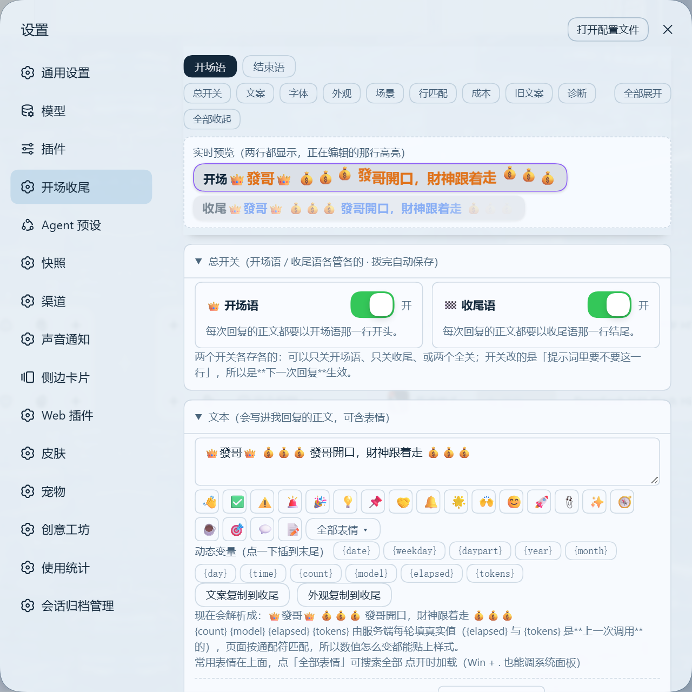

<h1 align="center">dsh-greet-signoff</h1>

<p align="center">开场语与收尾语：每次回复固定开场/收尾 —— 让每轮回复都带上你设定的一句开场与一句收尾，<br/>文字与样式都在设置页里改，改完下一轮回复即生效。<br/>（DeepSeek Harness 插件 · Web 端）</p>

<p align="center">
  
  
  
  
</p>

<p align="center">
  
</p>

## 这是什么

一个 DeepSeek Harness 的 Web 插件：**给每轮回复加上你配置的开场语与收尾语**，顺带把「这条会话花了多少钱」和「换会话时怎么把上下文带过去」这两件事做掉。

1. **固定开场语与收尾语**：每次回复的正文第一行是开场语、最后一行是收尾语，文字与样式都在设置里改；改完保存，下一轮回复即生效（不用重启）。
2. **正文行样式**：开场行与收尾行在对话里按各自配置渲染 —— 字号、颜色（含深色档）、字重、动效、形状、填充、边框、阴影、字距、大小写、斜体、自定义图片。
3. **花费台账**：设置页里有本条会话、今天 / 近 7 天 / 最贵几条会话的账，单价可配置，并与本机台账对账。全部读本机文件（`dsh-usage/usage-ledger.json`、`session_projcache`），**只为花费台账**，不联网、不外发、不建库。
4. **交接摘要**：正文里用 `<<<HANDOFF>>>…<<<END>>>` 给出的摘要，由界面落盘成工作区根目录的 `HANDOFF.md`；宿主半的提示段会在新会话开场时提醒先读它 —— 换会话时上下文才真的带得过去。
5. **场景与文案池**：文案池每轮从一池句子里挑一句（随机或按顺序）；「场景」把整份设置（文案 + 样式 + 池子）存成快照，工作/生活/深夜一键整包切换；还能按工作区目录前缀自动换文案。
6. **动态变量与自检**：固定行里可用 `{date}` `{weekday}` `{daypart}` `{time}` `{model}` `{count}` `{elapsed}` `{lastelapsed}` `{tokens}` `{lasttokens}`，由服务端每轮填真实值；设置页「诊断 → 跑一遍自检」把配置、文案、贴样式、连接自愈、两侧版本一次问到底。
7. **深浅色自动判定**：综合 `body[data-ds-dark-theme]`、根元素 `color-scheme`、系统偏好与页面底色亮度，结果写到 `<html data-gs-dark>`，dark-only 皮肤也能套对深色档颜色。
8. **连接自愈**：`dsh web` 重启会换令牌，已打开的页面会卡在"自动重连中"。本插件带看门狗：连续 30 秒连接异常、服务端可达（`/` 仍 200）、且输入框没有草稿时自动重载一次；服务真挂了不动作，本标签页每小时最多 3 次、间隔 ≥60 秒。

配置默认存在**插件目录里的** `config/greet-signoff.json`（本机即 `E:\dsh-greet-signoff\dsh-greet-signoff\config\greet-signoff.json`）——插件搬到哪、配置就跟到哪。想放别处就设环境变量 `DSH_GREET_SIGNOFF_HOME`（支持相对路径，按插件目录解析）；插件目录里还没有配置、而旧的 `$DSH_HOME/greet-signoff.json` 存在时，会继续用旧位置。**改完保存下一轮回复即生效，不需要重启**。

## 与官方上下文环的关系

DSH 现在**自带**一个上下文占用环：位置在**输入框内、发送按钮左侧**，**悬停**出「上下文已用 N%」提示，**点击**展开三段构成面板（系统提示词 / 工具与记忆 / 助手历史与工具结果）。

- 它和本插件原来自绘的那条上下文卡**读的是同一个 `contextPressure` 投影**，占用率算法也一致（`projectedTokens ?? pressureTokens ÷ contextWindow`）—— 等于同一个数字在屏幕上显示两遍。
- 所以从 **1.23.0** 起，本插件把输入框上方那块上下文卡**整套移除**：`conversation.input.dock` 不再注册，页面上不再有插件自绘的任何卡片；原来只服务于它的两个宿主接口 `GET /api/greet-signoff/session`（会话开始时间）与 `GET /api/greet-signoff/context`（构成明细）也一并删掉，`switches` 里的第三个总开关随之取消。
- **看占用率请看官方圆环**；本插件只负责三件事：**开场收尾 + 花费台账 + 交接摘要**。

## 为什么需要它

- **没有它**：每次想让 AI 的开场/收尾保持一致，只能自己写提示词、或者每次手动粘贴同一句；样式（颜色/字号/动效）更是完全没法统一。
- **与「写一段固定提示词」相比**：文案与样式都是**可配置项 + 页面渲染**——文案进提示段、样式由浏览器半给对话里那两行贴类渲染，两边共用同一份配置。
- **与 `dsh-context`（上下文仪表盘 / context 命令）相比**：本插件不采集、不落库、不开面板，只做固定行渲染与花费台账；两者可以共存。
- **与 `dsh-gold-capsule` 互斥**：那个插件用 `!important` 把**标题里的行内代码**渲染成金色胶囊，会把本插件设置的字色/底色/边框/形状/动效压掉。**固定行请保持纯文本一行**，两个插件只留一个负责首行样式。

## 安装

插件以 npm 包 / git 仓库为分发单元。**装完必须重启 `dsh web`**（组合层变更不会热加载）。

```sh
# 从 GitHub 安装（仓库名固定为 dsh-greet-signoff，用户名换成你自己的）
dsh plugin --profile web add github:weifa860504-droid/dsh-greet-signoff

# 或从本地目录安装（开发调试用）
dsh plugin --profile web add <本地包目录的绝对路径>
```

装完重启 web：重启后打开任意会话，回复的首尾两行应带上你配的样式；设置 → 开场收尾 里应出现配置页。

## 用起来是什么样

- **对话里**：每条回复第一行渲染成你配的开场样式（默认橙色 14px、无动效、直角），最后一行渲染成收尾样式（默认紫色 14px、无动效、直角）。中间正文不受影响。**一条回复被工具调用拆成多个块时，两行也各归各位**（按文案身份分配样式）。
- **设置页**：左侧菜单栏「开场收尾」一个入口；顶部是 `开场语 / 结束语` 段控 + 保存状态 + 「保存」按钮，改动自动保存（1.2 秒），下一次回复即生效。
- **两栏布局：预览常驻左栏**（v1.24.0）：左栏是预览卡 —— 开场与收尾两行都按真实样式渲染，**点哪一行就切到哪一行编辑**，下面就是「总开关」；右栏是参数表。改参数时预览一直在旁边，不用"滚下去改完再滚回来看"。
- **参数表 + 参数搜索**：总开关 / 文案 / 字体 / 外观 / 场景 / 行匹配 / 成本 / 旧文案 / 诊断 各是一组参数，一行一个参数；右栏顶部有**搜索框**（按参数名过滤，一组里一行都没命中就整组隐藏）与「跳到分区」下拉。设置抽屉只是窗口里的一小块（实测约 559px），所以窄下去用**容器查询**落成单列，不看视口宽度。
- **一键外观（16 套）**：财神金 / 极简灰 / 大字醒目 / 霓虹赛博 / 樱花 / 复古打字 / 海盐蓝 / 森林绿 / 紫罗兰 / 描边风 / 高亮笔 / 引用块 / 细下划线 / 墨绿终端 / 霓虹粉 / 纸质标签 —— 点一下即套用，**只改外观，不动文案与图片**。
- **30 种动效**：淡入 / 滑入 / 落下 / 缩放 / 翻转 / 光泽扫过 / 高光划过 / 呼吸 / 心跳 / 发光 / 霓虹闪 / 闪烁 / 弹跳 / 抖动 / 摇晃 / 摆动 / 倾斜 / 漂浮 / 旋转 / 波浪 / 彩虹流动 …… 外加 4 种**逐字**动效（逐字跳动 / 逐字波浪 / 逐字打字机 / 逐字彩虹；emoji 不会被拆散）。默认只列常用 6 项，末尾那条「▾ 显示全部 / ▴ 只看常用」切换。
- **表情选择器**：文案里可插表情，中文名/关键词索引随插件本地携带（`GET /api/greet-signoff/emoji-index`，首次展开表情框时才取）。
- **可搬走**：设置页底部可「导出配置 / 导入配置」（JSON）；「撤销上次保存」一键回退。
- **出问题能自查**：设置页「诊断」显示配置文件路径、贴样式器运行次数与耗时、命中行数、宿主半/浏览器半版本、规则文本与会话识别。



## 能力面

| 能力面 | 说明 |
| --- | --- |
| Prompt 段 | 向系统提示注册「开场与收尾」规则，每次组装提示时实时读取配置，因此改文案立即生效 |
| 配置接口 | `GET /api/greet-signoff` 读真值、`POST /api/greet-signoff` 写整份配置（设置页用的就是它） |
| 自检接口 | `GET /api/greet-signoff/rule-text` 回"这一刻模型会看到的规则文本" |
| 资源接口 | `GET /api/greet-signoff/asset/<name>` 回自定义图片；`GET /api/greet-signoff/emoji-index` 回表情中文名/关键词索引 |
| 台账接口 | `GET /api/greet-signoff/cost?sessionId=<id>&days=7` 回花费台账（本条会话 / 今天 / 近 7 天 / 最贵的几条） |
| 落盘接口 | `POST /api/greet-signoff/handoff` 写工作区根目录的 `HANDOFF.md`（已存在先备份 `.bak`；filename/cwd/text 三重校验） |
| 数据来源 | 只读本机 `dsh-usage/usage-ledger.json` 与 `session_projcache`（**仅为花费台账**）与配置目录；不联网、不外发、不建库 |
| 设置 UI | 只注册 `settings.section`（左侧菜单栏「开场收尾」一处入口） |
| 深浅判定 | 综合 `body[data-ds-dark-theme]`、根元素 `color-scheme`、系统偏好与页面底色亮度，结果写到 `<html data-gs-dark>`；dark-only 皮肤也能正确套用深色档颜色 |

本插件**不注册模型工具**，也不发布宿主服务（仅消费 `systemPrompt`、`webServer` 两个宿主服务与浏览器端的 `slots`）。

## 配置

### 行级可配项（开场、结束语各一套，共 19 项）

| 字段 | 含义 | 默认（开场 / 结束语） |
| --- | --- | --- |
| `text` | 文案（写进回复正文，可含表情） | `👋 你好，我是 DeepSeek Harness 助手。` / `✅ 以上，随时叫我。` |
| `image` / `imageHeight` | 自定义图片（≤300KB，PNG/JPEG/GIF/WebP）与高度 | 空 / 22 |
| `fontSize` | 字号 10–40 | 14 / 14 |
| `fontWeight` | 字重（400/500/600/700/800） | 600 / 600 |
| `color` | 文字颜色（空=跟随主题） | 空 / 空 |
| `colorDark` | 深色主题下的文字颜色（空=沿用 `color`） | 空 / 空 |
| `animation` / `animSpeed` | 动效（30 种，含 4 种逐字）与倍速 1–4 | `none` / 1 |
| `shape` / `radius` | 形状（10 种：pill/round/soft/rect/card/tag/underline/highlight/blockquote 等）与圆角 0–999 | `none` / 12 |
| `padY` | 纵向内边距 0–24 | 5 / 5 |
| `fill` / `bgColor` | 填充方式（none/faint/theme/solid）与背景色 | `none` / 空 |
| `bgColorDark` / `borderColorDark` | 深色主题下的背景色 / 边框色（空=沿用浅色值） | 空 / 空 |
| `borderWidth` / `borderColor` | 边框 0–6 与颜色 | 0 / 空 |
| `shadow` | 阴影（none/soft/medium/strong/glow） | `none` / `none` |
| `letterSpacing` | 字距 −2…12 | 0 / 0 |
| `caps` | 大小写（none/upper/lower） | `none` / `none` |
| `italic` | 斜体 | false / false |

> 允许值都有白名单，非法值会被自动回落到默认；未知字段会被丢弃。

### 全局可配项

| 字段 | 含义 | 默认 |
| --- | --- | --- |
| `pricing` | 计价口径：未命中输入 / 缓存命中输入 / 输出（元每百万） | 1 / 0.02 / 4 |
| `pool` | 文案池：`{ enabled, mode: "sequence" \| "random", greeting: [], signOff: [] }` | 关闭 |
| `scenes` | 场景快照列表（每项是整份设置的快照，含文案、样式、池子） | `[]` |
| `bindings` | 按工作区绑定（目录前缀 → 文案/样式覆盖） | `[]` |
| `matchMode` | 固定行匹配方式：`exact` 逐字相同 / `loose` 宽松（忽略大小写、空白、全半角与首尾标点）/ `fuzzy` 近似容错 | `loose` |
| `onlyAssistant` | 只给助手的回复贴样式；`false` 时整段对话都贴 | true |
| `legacyLines` | 旧文案兼容表：`[{ text, style: "greeting" \| "signOff" }]`，最多 30 条，**只影响页面渲染，不写进提示词** | `[]` |
| `switches` | 两个独立总开关：`{ greeting, signOff }`（见下一节） | 两个都开 |

> 旧版本里的布尔字段 `looseMatch` 仍可读（`false` 等价于 `matchMode: "exact"`）。

### 两个总开关（v1.23.0）

设置页最顶上是一排**苹果（iOS）样式的滑动开关**，两个功能各管各的：

| 开关 | 关掉之后 |
| --- | --- |
| 👑 开场语 | 提示段里不再要求「每次回复以开场语开头」——模型之后就不写这一行了。文案与样式都留着。 |
| 🏁 收尾语 | 同上，改的是「结尾那一行」。 |

- 两个开关改的是**写进系统提示的那段规则**，所以是**下一次回复**生效（不用重启 DSH：宿主半每轮组装提示时都会重读配置）。**关掉的那一行不写进提示段，下一次回复生效。**
- 配置里只认**明确写成 `false`** 为「关」；缺字段、写成字符串、写成 `0` 一律当「开」——手改坏配置也不会让整块功能凭空消失。
- 两个都关也不会报错：提示段整段不渲染，只剩干净的回复正文。

### 固定行是怎么被认出来的

设置页里写的那句开场语/收尾语会进提示段，模型照原样输出；页面上由浏览器半按**文本比对**给那一行贴样式类：

- 三档匹配（设置页里可切）：
  - **逐字相同**：只认归一化后完全相同的文本；
  - **宽松**（默认）：先去掉零宽字符、压缩空白，再做 Unicode NFKC（全角→半角）、把中文标点折叠成 ASCII（`，`→`,`、`。`→`.`）、去掉所有空白、削掉首尾的引号/括号/星号/井号与句读，并统一小写；
  - **近似容错**：在宽松的基础上再算编辑距离，相似度 ≥ 86% 且长度差 ≤ 25% 才算命中（例如只差一个字、一个数字）。
- **多行文案**：文案里可以换行；如果宿主把换行渲染成两个段落，两段会依次比对、都贴上同一套样式。
- **动态变量**：`{date}` `{year}` `{month}` `{day}` `{weekday}` `{daypart}` `{time}` `{model}` `{count}` `{elapsed}` `{lastelapsed}` `{tokens}` `{lasttokens}`；宿主在写提示词时就解析成具体文字，页面渲染时按同一套规则解析（带 `{daypart}` 时页面会把所有时段都当作候选，正好跨过时段边界也不会掉样式）。
- **只贴助手的回复**（默认开）：宿主给每个消息块打了 `data-chat-flow-kind`，用户消息、工具结果、思考面板一律跳过；认不出的宿主版本会退化成"整段都贴"，不会整片失效。
- 候选标签是 `p / li / div / span / h1–h6 / code`，因此模型偶尔把固定行写成 `# 标题`、`**加粗**` 或用反引号包起来也能命中；
- 同一行同时命中外层与内层时只保留最外层；**一条回复被工具调用拆成多个块时，按"文案身份"分配样式**（命中开场文案=开场样式），只有两行文案其实是同一句时才退回按位置区分。

模型若把固定行整段改写（换词、多字少字），那就不再是"同一行"，不会贴样式——这是有意的：宁可不动，也不能把正文里的普通句子误判成固定行。

### 花费与上下文（v1.20.0 起，全部读本机文件，不联网）

**这一版只剩花费台账了**（上下文占用率请看官方圆环，见上文「与官方上下文环的关系」）。

- **本会话 ≈¥ 花费**：本条会话累计花了多少钱。金额按计价口径算（默认未命中输入 ¥1/M、缓存命中输入 ¥0.02/M、输出 ¥4/M，可在配置里改），数据来自本机上下文投影与 `$DSH_HOME/dsh-usage/usage-ledger.json`（两个时段桶都累加，并与台账自带金额对账）。
  顺带记住这条：**输出价是缓存读的 200 倍** —— 少让我啰嗦，比省那点上下文更省钱。
- **今天 / 近 7 天 / 最贵会话**：设置页「花费与上下文」给出这几档账，全部由 `GET /api/greet-signoff/cost` 提供。
- **交接包**：正文里 `<<<HANDOFF>>>…<<<END>>>` 的摘要由界面**落盘**成工作区根目录的 `HANDOFF.md`（已有同名文件会先备份 `.bak`），宿主半的提示段会在新会话开场时提示先读它 —— 换会话时上下文才真的带得过去。
- **宿主半是旧版时**：花费台账显示"读不到"，固定行样式照常工作，不会因为缺数据出问题。

### 接口与权限

`webServer` 注册的是**同源接口**：浏览器端用页面自身的登录态访问，因此你不需要手填 token。

```sh
# 读配置真值（loopback 本机访问免 token；从别处访问需带页面的 Authorization）
curl http://127.0.0.1:3080/api/greet-signoff

# 写整份配置（JSON，字段同上）
curl -X POST -H "Content-Type: application/json" \
     --data @greet-signoff.json http://127.0.0.1:3080/api/greet-signoff

# 花费：本条会话 / 今天 / 近 7 天 / 最贵的几条
curl "http://127.0.0.1:3080/api/greet-signoff/cost?sessionId=<会话 id>&days=7"

# 自检：这一刻模型会看到的规则文本
curl "http://127.0.0.1:3080/api/greet-signoff/rule-text"

# 表情索引
curl "http://127.0.0.1:3080/api/greet-signoff/emoji-index"

# 自定义图片资产
curl "http://127.0.0.1:3080/api/greet-signoff/asset/<name>"

# 把交接摘要落盘成工作区根目录的 HANDOFF.md（要带绝对路径 cwd）
curl -X POST -H "Content-Type: application/json" \
     --data '{"cwd":"E:\\work\\proj","filename":"HANDOFF.md","text":"……摘要正文……"}' \
     http://127.0.0.1:3080/api/greet-signoff/handoff
```

接口只在 DSH 自己监听的地址上提供，**不额外开端口、不对外发包**；配置与图片资产都落在本机
（`<插件目录>/config/greet-signoff.json` 与 `<插件目录>/config/greet-signoff-assets/`，路径口径见上文「这是什么」结尾一段）。唯一的写操作是 POST `/handoff`（写摘要文件）。
这也意味着：能在这台机器上跑的程序（包括其它本地脚本）可以读写这份配置——这是 DSH 本机免认证的既有设计，请按"本机自用"来理解它。

## 已知限制

- **花费数字来自上一轮请求结束后的投影**：你刚发出去的那句话要等这轮答完才计入，轮内不动是设计使然，不是卡住。
- **宿主半旧版时功能降级**：`/cost` 由宿主半提供；宿主半没重启到新版时，花费台账整段显示"读不到"，固定行样式照常工作。
- **依赖宿主 DOM 结构**：对话里那两行是"匹配文本后贴样式类"实现的——按消息块判定并排除思考/推理面板。宿主若改动消息的 DOM 结构或分块方式，可能出现"样式没贴上"或"贴错行"；升级宿主后建议扫一眼对话里的两行。
- **模型整段改写固定行时不贴样式**：匹配是"同一句话"级别，不是"意思相近"级别（见上文）。真遇到了，可把匹配切到「逐字相同」来确认，或把开场语写得更独特一些。
- **两行文字相同时**：如果你把开场语与结束语设成同一句话，两行样式仍会按位置各自生效（首行=开场样式、末行=收尾样式），但**文字看起来一样**。
- **`HANDOFF.md` 会被后来的交接覆盖**：同一目录多次交接时，新摘要覆盖旧的（覆盖前自动备份同名 `.bak`）。交接完就接着开新会话，别拖着。
- **装完要重启**：本包声明了组合层（`dsh.bundle.patch`），安装/升级后需要重启 `dsh web`；页面刷新不够。
  浏览器半（`client.js`）的改动刷新页面即可；宿主半（`index.mjs`，含 `/cost`、`/handoff`）必须重启。
- **深浅判定是启发式**：四条证据都不成立时（皮肤既不声明 `color-scheme`、底色又是透明或图片）会判成浅色。
  设置页「诊断 → 健康自检」里能看到四条证据的实测值，配色不对时先看那一行。
- **单份配置**：所有 profile/会话共用同一份 `<插件目录>/config/greet-signoff.json`；场景与文案池也在这一份里。
- **平台**：浏览器半仅在 Web 端注册 UI；宿主半（提示段与配置接口）不依赖平台。
- **数据安全**：配置保存是原子写（`.tmp` + 改名），并保留上一份 `.bak`；解析失败时会回落到默认值并在宿主日志里打一条 `config unreadable`，此时请从 `.bak` 手工恢复。

## 插件管理

已装插件的启停与安装态，用 dsh 自带的命令管理即可：

```sh
dsh plugin --profile web list        # 查看当前 profile 装了哪些插件
dsh plugin --profile web remove <包名>  # 卸载（装完同样重启 web）
```

若要临时停用本插件而不卸载：在 profile 的 `cordis.patch.yml` 里给它加一行

```yaml
- id: greet-signoff
  disabled: true
```

（该文件是热生效的，改完不必重启。）

## 版本与更新

当前版本 **1.23.0**。版本历史见 [CHANGELOG.md](CHANGELOG.md)。开发/发版前的自检：

```sh
npm test                               # 纯函数与数据解析单测（把 client.js / index.mjs 用最小桩加载进 Node）
npm run verify                         # 元数据、发布物清单、占位符、体积阈值、CHANGELOG 版本一致性
npm pack --dry-run                     # 预览真正会被打包的文件
```

发版流程（含 CI 启用与 npm 发布步骤）见 [docs/RELEASING.md](docs/RELEASING.md)。

> README 里的两张预览图（`docs/preview-chat.png`、`docs/preview-settings.png`）是 **1.23.0** 从真实页面无头截的：
> 对话图里只有开场语 / 收尾语两行（输入框上方已无插件卡片），那张仍然有效；
> **设置图还是「折叠卡片 + 跳转胶囊」的旧布局，v1.24.0 起设置页已换成「预览为主 + 参数表」两栏，待重拍。**

## 许可

[MIT](LICENSE)
